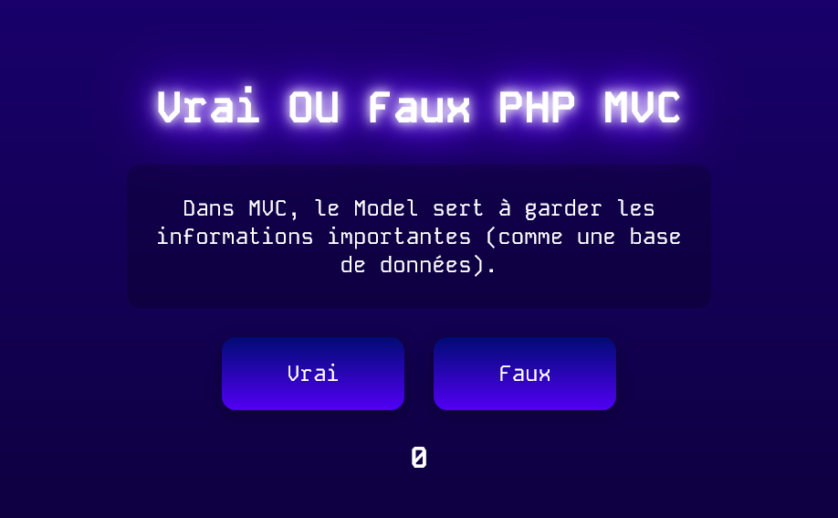

# 🎮 Vrai ou Faux: Édition PHP MVC

[](https://opensource.org/licenses/MIT)

Un jeu de quiz interactif conçu pour tester et améliorer votre compréhension du modèle d'architecture Modèle-Vue-Contrôleur (MVC).

<!-- Vous pouvez remplacer ceci par une vraie capture d'écran de votre jeu ! -->
<<<<<<< HEAD

=======

>>>>>>> ab5159e67fb0a5ad1407959d65a5f4431d1ff37c

---

## 🎯 Objectif du Projet

Ce projet est un jeu de quiz "Vrai ou Faux" servant d'exercice pratique pour introduire l'architecture logicielle MVC (Modèle-Vue-Contrôleur) à des étudiants de première année, avec un focus sur son implémentation en PHP.

## ✨ Fonctionnalités

-   Une série de questions vrai/faux sur les concepts fondamentaux de MVC.
-   Retour instantané sur vos réponses.
-   Suivi du score en temps réel.
-   Interface utilisateur simple, propre et réactive, construite avec des technologies web vanilles.

## 🛠️ Technologies Utilisées

-   **Frontend :** HTML5, CSS3, JavaScript (ES6+) vanilles
-   **Outils :** Aucun outil de build ou bibliothèque externe requis.

## 🚀 Démarrage

Aucune configuration complexe n'est nécessaire !

1.  **Clonez le dépôt :**
    ```bash
    git clone https://github.com/votre-nom-utilisateur/vrai-faux-php-mvc.git
    ```
2.  **Naviguez jusqu'au répertoire :**
    ```bash
    cd vrai-faux-php-mvc
    ```
3.  **Ouvrez l'application :**
    Ouvrez simplement le fichier `src/index.html` dans votre navigateur web préféré.

## 🕹️ Comment Jouer

1.  Cliquez sur le bouton **"Commencer"** pour démarrer le quiz.
2.  Lisez l'affirmation affichée à l'écran.
3.  Sélectionnez **"Vrai"** ou **"Faux"**.
4.  Votre score sera mis à jour et la question suivante apparaîtra automatiquement.
5.  Un message de fin s'affichera à la fin du quiz.

## 🤝 Comment Contribuer

Les contributions pour améliorer le jeu ou ajouter du contenu sont les bienvenues !

1.  **Forkez le dépôt.**
2.  **Créez une nouvelle branche** pour votre modification (`git checkout -b feature/mon-amelioration`).
3.  **Faites vos modifications.**
4.  **Commitez vos changements** (`git commit -m 'feat: Mon amélioration'`).
5.  **Poussez vers la branche** (`git push origin feature/mon-amelioration`).
6.  **Ouvrez une Pull Request.**

## 📄 Licence

Ce projet est sous licence MIT. Consultez le fichier [LICENSE](LICENSE) pour plus de détails.

---
*Construit par _Duck-Noris_ comme un moyen amusant d'apprendre l'architecture logicielle.*
